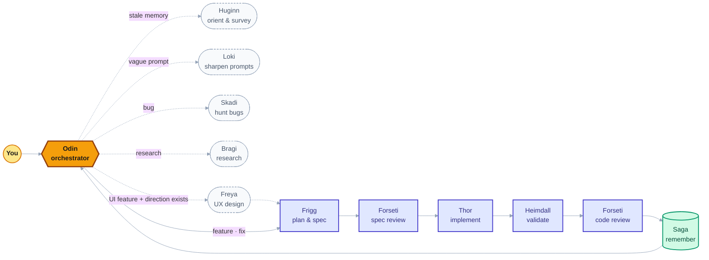
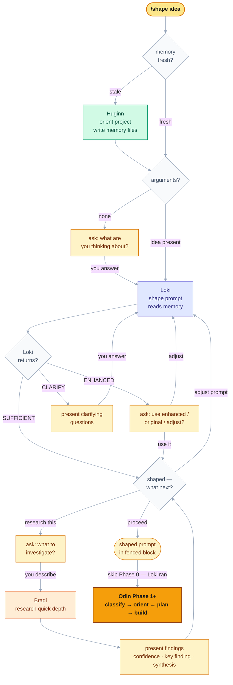

# Mimir · v2.7.0

A Claude Code plugin that orchestrates software engineering work through a pipeline of specialized agents. You describe what you want to build. Mimir plans it, reviews the plan, implements it, validates it, reviews the code, and captures what it learned — then asks you what to do with the result.



---

## Table of Contents

- [How it works](#how-it-works)
- [Requirements](#requirements)
- [Installation](#installation)
- [Usage](#usage)
- [Agents](#agents)
- [Skills](#skills)
- [Hooks](#hooks)
- [Memory](#memory)
- [Pipeline state](#pipeline-state)
- [Working on Mimir](#working-on-mimir)
- [Design philosophy](#design-philosophy)

---

## How it works

You start a session with Odin as your session agent. He classifies your intent, recommends an approach, and dispatches specialized agents to do the work. He never writes code himself.

A typical feature pipeline:

```
You describe the task
  → Odin orients (Huginn surveys the codebase if memory is stale)
  → Odin recommends an approach (plan first / just implement / discuss)
  → Frigg produces a spec: steps, file ownership, parallel groups
  → Forseti reviews the spec for structural quality (criteria consistency,
    AC coverage, dependency accuracy, parallelization safety)
  → Odin presents the full plan to you (goal, acceptance criteria, steps)
  → Odin asks how to dispatch (1 Thor, or N parallel Thors in worktrees)
  → Thor implements following write-only TDD
  → Heimdall validates against acceptance criteria, runs tests
  → Forseti reviews the diff for correctness, security, maintainability
  → Saga captures learnings to project memory
  → Odin asks: create PR / merge locally / discard
```

For UI features, establish design direction first with `/mimir:design-direction`. When `design-direction.md` exists in project memory, Odin spawns Freya to produce interaction specs before Frigg plans and Volundr implements.

For bugs, Skadi investigates hypotheses in parallel before implementation.

---

## Requirements

- [Claude Code](https://code.claude.com) — latest version
- Git — Mimir creates branches and worktrees
- **For parallel dispatch** (multiple implementers): `CLAUDE_CODE_EXPERIMENTAL_AGENT_TEAMS=1` in your `~/.claude/settings.json`

```json
{
  "env": {
    "CLAUDE_CODE_EXPERIMENTAL_AGENT_TEAMS": "1"
  }
}
```

Without this flag, parallel dispatch is unavailable. Odin will warn you at session start and fall back to sequential dispatch if you proceed without it.

---

## Installation

### From GitHub

In Claude Code, run these two slash commands:

```
/plugin marketplace add nilssonr/mimir
/plugin install mimir@mimir
```

The first command registers the Mimir marketplace from GitHub. The second installs the plugin.

### From local clone

Clone the repository, then in Claude Code:

```bash
git clone https://github.com/nilssonr/mimir.git
```

```
/plugin marketplace add ./mimir
/plugin install mimir@mimir
```

### Keeping Mimir up to date

```
/plugin marketplace update mimir
```

---

## Usage

### Starting a session

Start Odin explicitly by passing `--agent mimir:odin` when launching Claude Code:

```bash
claude --agent mimir:odin
```

For convenience, add an alias to your shell config:

```bash
alias odin='claude --agent mimir:odin'
```

Then just run `odin` from any project directory.

### Describing work

Just describe what you want. Odin handles classification:

```
Add rate limiting to the API endpoints
Fix the login redirect loop on mobile
Review my changes on feat/auth-refactor
How does the payment flow work?
```

**For vague prompts**, Odin dispatches Loki to enhance them using project memory. You'll see the enhanced version and choose to use it or the original.

### Intent types

| Intent | What Odin does |
|---|---|
| Feature / Fix | Plans and implements via the full pipeline |
| Bug | Spawns Skadi to investigate hypotheses first |
| Review | Spawns Forseti on a branch, PR, or codebase dimension |
| Discussion | Answers directly, no pipeline |
| Research | Dispatches Bragi to research; presents findings |

### Approach options

For features and fixes, Odin presents a recommendation:

- **Plan first** — Frigg explores the codebase and writes a spec before any code is written. Recommended for multi-file or complex work.
- **Just implement** — Thor works directly from your description. Recommended for single-file, clear-scope tasks.
- **Discuss first** — Talk through the approach before committing to implementation.

### What happens after "Plan first"

1. **Frigg writes the spec** — steps with file ownership and parallel groups.
2. **Forseti reviews the spec** (non-trivial plans only — skipped for plans with ≤3 low-complexity steps). Checks six dimensions: criteria falsifiability, AC-to-step coverage, criteria vs. detail consistency, dependency accuracy, file list completeness, and parallelization safety. If high-confidence issues are found, Odin presents them and offers to dispatch Frigg for a revision before any code is written.
3. **Odin presents the plan to you** — goal, acceptance criteria, all steps with complexity ratings, and parallelization groups. You see the full plan before you're asked how to dispatch.
4. **Dispatch decision** — parallel or sequential, based on file overlap and step count.

### Dispatch options

After seeing the plan, choose:

- **Single Thor** — sequential, one worktree, no merge needed
- **Parallel Thors** — each group in its own git worktree, merged after completion

Odin states the observable signal: "Groups share no files → parallel" or "Shared migration file → sequential."

If any implementer signals it's blocked (can't proceed without external input), Odin presents the blocker before proceeding to validation — not after.

### Review workflows

| Command | What happens |
|---|---|
| "Review my changes" | Forseti diffs your branch against main |
| "Review PR #42" | Forseti reads the PR via `gh` and reviews the diff |
| "Code health" | Skadi instances investigate multiple dimensions in parallel |
| "Review security of X" | Forseti with a security lens |

### Terminal options

At the end of a pipeline, Odin presents:

- **Create PR** — pushes the feature branch and opens a PR via `gh`
- **Merge locally** — merges the feature branch to your starting branch
- **Discard** — resets to the starting commit, deletes the branch

---

## Agents

All agents live in `agents/`. Each agent file declares its model, tools, and skills in frontmatter. When Odin spawns an agent by name (`subagent_type=mimir:thor`), the platform loads the agent's instructions as the system prompt and injects the declared skills automatically.

### Odin
**File**: `agents/odin.md` | **Model**: Sonnet | **Entry point**: yes

The orchestrator. Classifies intent, recommends approaches, dispatches agents, tracks pipeline state. Never writes source code. All decisions are presented with the observable signal that drives them.

### Frigg
**File**: `agents/frigg.md` | **Model**: Sonnet

The planner. Explores the codebase, assesses what she finds (tech debt, test coverage gaps, coupling), decomposes into steps with file ownership, groups steps for parallelization, writes the spec. Before writing, she cross-checks every step's `criteria` field against its `detail` field — if the criteria asserts X but the detail implements Y and Y doesn't produce X, she resolves the contradiction before writing. No silent planning on a shaky foundation.

### Thor
**File**: `agents/thor.md` | **Model**: Sonnet | **Skills**: tdd, git-workflow

The implementer. Receives a spec or direct task, reads existing tests before touching the code (both on initial implementation and on fix tasks), follows write-only TDD (writes tests first, never runs them), commits each step. Works in the project root or a dedicated git worktree for parallel dispatch. Signals `BLOCKED` to Odin via SendMessage if it cannot proceed without external input.

### Volundr
**File**: `agents/volundr.md` | **Model**: Sonnet | **Skills**: frontend-design, design-system, git-workflow

The frontend craftsman. Used instead of Thor for UI work. Implements from Freya's interaction spec, verifies visually using Chrome DevTools MCP, checks accessibility, iterates until it matches the spec. Signals `BLOCKED` to Odin via SendMessage if it cannot proceed.

### Heimdall
**File**: `agents/heimdall.md` | **Model**: Sonnet | **Skills**: review-standards

The validator. Runs the full test suite, checks every acceptance criterion from the spec with a file:line citation, runs code quality tools, checks for regressions outside the spec's file scope. Read-only for source code. Produces `validation.md`.

### Forseti
**File**: `agents/forseti.md` | **Model**: Sonnet | **Skills**: review-standards

The reviewer. Supports two fundamentally different review modes:

**Code review** (branch, PR, focused, scoped, re-review): Reviews diffs across 11 dimensions (correctness, security, error handling, performance, defensiveness, readability, cognitive load, testability, consistency, side effects, API design). Confidence-scores every finding, suppresses below 80. Reads `decisions.md` before flagging deliberate design choices.

**Spec review**: Reviews a Frigg-produced spec before any code is written. Applies six spec-specific dimensions (criteria falsifiability, AC-to-step coverage, criteria vs. detail consistency, dependency accuracy, file list completeness, parallelization safety). Does not apply code-quality dimensions to prose planning documents. Suppresses findings below 60% confidence. Produces `forseti-spec-review.md`.

### Saga
**File**: `agents/saga.md` | **Model**: Haiku

The keeper of memory. Runs after validation and review. Reads the spec, validation results, review findings, fix iteration count, and pipeline state (including `conductor_notes` for out-of-pipeline behavior). Writes decisions and process learnings to project memory. Logs genuine pipeline issues to `~/.claude/state/mimir/issues.md`.

### Huginn
**File**: `agents/huginn.md` | **Model**: Haiku

Odin's raven of thought. Surveys a new or unfamiliar project and writes structured knowledge to project memory. Spawned when memory is missing or stale (detected by comparing `.huginn-state` commit hash against `HEAD`). First creates a stack-appropriate `.gitignore` if one is missing — preventing Glob patterns from traversing `node_modules/` and build artifacts on every subsequent agent run. Then writes five memory files and records the git state for freshness tracking.

### Loki
**File**: `agents/loki.md` | **Model**: Haiku

The transformer. Receives a vague prompt and project memory context. Uses five dimensions (scope, context, acceptance criteria, constraints, file references) to decide: `SUFFICIENT` if the prompt is already specific, `ENHANCED` if memory can fill the gaps, or `CLARIFY` if only the user can resolve the ambiguity. The output format is mandatory for every response — Loki never falls back to free-text, even for highly ambiguous input. CLARIFY questions always lead with what Loki found in context. If CLARIFY is needed twice, Odin stops and tells the user to rephrase.

### Bragi
**File**: `agents/bragi.md` | **Model**: Sonnet

The research agent. Resolves known unknowns from external sources so that Odin and Mimir can make decisions from evidence. Dispatched for Research intents and for design direction sessions (when establishing `design-direction.md`). Receives a structured handoff — Topic, Established (pre-classified facts Bragi won't re-research), Investigate (known unknowns), Purpose, Constraints, Depth — and returns Confidence, Key finding, Synthesis with KNOWN/INFERRED/UNCERTAIN labels, and Open questions. Talks to agents, not humans — never interrupts execution to ask questions.

### Skadi
**File**: `agents/skadi.md` | **Model**: Sonnet

The hunter. Investigates bugs by testing specific hypotheses. Multiple Skadi instances can run in parallel (via Agent Teams), each pursuing a different root cause theory. Each writes its findings to a separate file (`findings-{hypothesis-slug}.md`), which Odin reads and synthesizes. Never fixes — only investigates.

### Freya
**File**: `agents/freya.md` | **Model**: Sonnet

The UX designer. Requires `design-direction.md` in project memory — if it's absent, she refuses immediately. Produces interaction specs: states (empty, loading, populated, error, edge cases), interaction flows, content hierarchy, accessibility requirements, responsive behavior. Every decision traces back to the design direction. Never writes code.

### Mimir
**File**: `agents/mimir.md` | **Model**: Sonnet

The advisor. Used for working on Mimir itself — not on your projects. Reads an index of accumulated knowledge at bootstrap, then loads individual memory files on demand as topics arise. Reads past run issues, researches Claude Code internals, proposes improvements with evidence, challenges bad ideas. Epistemically strict: every claim is labeled KNOWN, INFERRED, or UNCERTAIN. Invokes the Uncertainty Protocol (AskUserQuestion gate) before proceeding on unverified ground. Can dispatch Bragi for research tasks that require external sources.

---

## Skills

Skills are reusable instruction sets declared in each agent's frontmatter. When Odin spawns an agent by name, the platform injects the declared skills into the agent's context automatically — Odin does not read or compose skill files manually.

### tdd
**File**: `skills/tdd/SKILL.md` | **Used by**: Thor, Volundr

Write-only test-driven development. RED (write tests) → GREEN (write minimum implementation) → REFACTOR (clean up) → COMMIT. The critical constraint: **never run tests**. Heimdall runs all verification. This keeps Thor's context clean and separates concerns cleanly.

### git-workflow
**File**: `skills/git-workflow/SKILL.md` | **Used by**: Thor, Volundr

Conventional commit format (`type(scope): description`), branching conventions, HEREDOC commit messages, pushing rules. The `commit-validator` hook enforces the format at the shell level — this skill teaches agents the same standard so they write correct messages the first time.

### review-standards
**File**: `skills/review-standards/SKILL.md` | **Used by**: Heimdall, Forseti

11-dimension review checklist with confidence scoring (suppress below 80), severity levels (CRIT / WARN / INFO), calibration rules, and finding format. Shared between validation and review so both use identical standards. Note: Forseti's spec review type uses separate spec-specific dimensions defined in `forseti.md` directly — not these 11 code-quality dimensions.

### frontend-design
**File**: `skills/frontend-design/SKILL.md` | **Used by**: Volundr

Production-grade UI guidelines: typography (avoid generic fonts), color (committed palettes, not timid distributions), motion (CSS-first, high-impact moments), spatial composition (asymmetry, scale jumps, negative space), anti-slop rules. Pre-build checklist: read existing patterns, verify CSS foundation, review design tokens.

### design-system
**File**: `skills/design-system/SKILL.md` | **Used by**: Volundr

Project-specific design system conventions. Token categories (colors, typography, spacing, radii, shadows), component patterns, accessibility requirements. This skill is a template — customize it per project to encode your actual design tokens and component conventions.

### shape
**File**: `skills/shape/SKILL.md` | **User-invocable**: `/shape [rough idea]`

The brainstorming entry point. Use when you don't know what you want to build yet, or when you have a direction but want to explore it before committing to a pipeline run. Unlike other skills — which are injected into agents — `/shape` is invoked by you directly and runs as Odin, orchestrating Huginn, Loki, and Bragi in sequence.

Type `/shape` with no arguments to start from scratch. The Bragi research loop is repeatable — investigate multiple questions, revise the shaped prompt between them, and proceed when you're ready. The confirmed prompt hands off directly into Phase 1, bypassing the normal Phase 0 Loki check.



### design-direction
**File**: `skills/design-direction/SKILL.md` | **User-invocable**: `/mimir:design-direction [feature description]`

The design direction manager. Establishes or refines `design-direction.md` in project memory — the file Freya reads before every interaction spec. Invoked by you when you want to establish or update design direction; **never triggered automatically by Odin.**

When run: checks whether a direction already exists. If absent, Bragi researches the appropriate direction for the project's domain and users, then enters a multi-turn brainstorming loop with Freya to refine it. If present, offers Review (alignment gap report), Revise (targeted updates), or Extend (new aspects) — each handled through the same Freya loop.

Run `/mimir:design-direction` before starting UI feature work. Once `design-direction.md` exists, Odin will spawn Freya automatically when you select "Plan first" on a UI feature.

---

## Hooks

Hooks are deterministic enforcement. Unlike instructions (which models can ignore), shell scripts either exit 0 or they don't. All hooks are defined in `hooks/hooks.json` with `${CLAUDE_PLUGIN_ROOT}`-prefixed paths so they work regardless of installation location.

### commit-validator
**File**: `hooks/scripts/commit-validator.sh` | **Trigger**: `PreToolUse` → `Bash`

Intercepts `git commit -m` commands before they execute. Validates the commit message against conventional commit format: `type(scope): description` where type is one of `feat`, `fix`, `docs`, `style`, `refactor`, `test`, `chore`. Exits 2 (blocks the commit) on violation. Handles both heredoc-style and simple `-m "message"` formats.

### auto-format
**File**: `hooks/scripts/auto-format.sh` | **Trigger**: `PostToolUse` → `Write|Edit`

Runs the project's formatter on any file written or edited. Language detection by extension:

| Extension | Formatter |
|---|---|
| `.go` | `gofmt` |
| `.rs` | `rustfmt` |
| `.ts`, `.tsx`, `.js`, `.jsx` | `prettier` |
| `.cs` | `dotnet format` |
| `.py` | `ruff format` |

Silently skips if the formatter isn't installed or the file doesn't match.

### session-start
**File**: `hooks/scripts/session-start.sh` | **Trigger**: `SessionStart`

Injects project context at the start of every session (including after compact and resume). Outputs a `<project-context>` block containing:
- Current branch and last commit
- Uncommitted file count
- Detected stack (Go, Rust, Node/TS, C#, Python, Angular)
- In-progress pipeline status (task ID + stage, if any)

This gives Odin immediate orientation without reading files.

### stop-gate
**File**: `hooks/scripts/stop-gate.sh` | **Trigger**: `Stop`

Blocks session completion when code changes are present but tests fail or changes are uncommitted. Detects the stack and runs the appropriate test runner. Checks for uncommitted source files after tests pass. Exits 2 to block; exits 0 to allow. Includes a `stop_hook_active` guard to prevent infinite loops.

---

## Memory

Mimir maintains two kinds of memory: **project memory** (what this codebase is) and **pipeline memory** (what Mimir learned from running).

### Project memory

**Location**: `~/.claude/projects/{project-slug}/memory/`

The project slug is the absolute project path with `/` replaced by `-` (e.g., `/Users/you/Code/myapp` → `-Users-you-Code-myapp`).

#### How it's written

Huginn writes project memory on the first run, and whenever memory is stale (the commit hash in `.huginn-state` doesn't match `HEAD`).

| File | Contents |
|---|---|
| `stack.md` | Language, version, frameworks, key dependencies, build tools, test runner, linter, formatter, package manager |
| `structure.md` | Directory layout, package/module boundaries, key files, entry points |
| `conventions.md` | Error handling patterns, test patterns, naming conventions, DI approach, code style beyond linters |
| `architecture.md` | Key abstractions, data flow, API patterns, auth model, state management, database access |
| `domain.md` | Business entities, API surface, domain-specific terminology |
| `.huginn-state` | Git commit hash, branch, dirty flag, timestamp — used to detect staleness |

Every claim in memory files must reference a specific file. Huginn never speculates.

#### How it's read

Odin derives the memory path from the current working directory — it never searches for it. The formula is deterministic: `/Users/you/Code/myapp` → `~/.claude/projects/-Users-you-Code-myapp/memory`. This means project memory is always project-scoped, even when multiple projects exist simultaneously.

Frigg reads all five memory files to anchor her plans in the actual codebase. Thor reads `conventions.md` and `stack.md` to match existing patterns. Forseti reads `conventions.md`, `architecture.md`, and `decisions.md` before reviewing.

#### Design direction (UI projects)

Run `/mimir:design-direction` before starting UI feature work. This skill coordinates Bragi research and a multi-turn Freya brainstorming session to establish `design-direction.md` in project memory. Odin never triggers this workflow automatically — it is always user-initiated.

Once `design-direction.md` exists, Odin detects it automatically when you select "Plan first" on a UI feature and spawns Freya to produce an interaction spec before planning. `design-direction.md` defines:

- **Philosophy**: One-sentence guiding principle
- **Personality**: Adjectives that describe how the product should feel
- **Visual language**: References, density, typography, color, motion preferences
- **Verifiable rules**: Concrete constraints checkable in code (spacing scale, color tokens, typography limits, naming conventions) — Forseti enforces these during review
- **Constraints**: What's always required and what's never allowed
- **Component character**: How buttons, forms, cards, navigation, and feedback should feel

Once written, `design-direction.md` persists across all future UI work for the project. Freya reads it before every interaction spec. Volundr reads it before every implementation. Forseti enforces the Verifiable Rules section on every UI diff.

#### Project-level learnings

Saga writes two additional memory files after every successful pipeline run:

| File | Contents |
|---|---|
| `decisions.md` | Technical choices worth remembering: what was chosen, why, what was considered |
| `process.md` | Process learnings: what happened, the impact, what to do next time |

These accumulate over time. Frigg reads `decisions.md` to avoid re-litigating settled choices. Forseti reads it to avoid flagging deliberate design decisions as problems.

---

### Pipeline memory

**Location**: `~/.claude/state/mimir/{project-slug}/`

The project slug is derived the same way as for project memory — the absolute project path with `/` replaced by `-`. Each project gets its own state directory, so multiple projects can have pipelines in progress simultaneously.

#### pipeline.yaml

Odin writes this file at the start of execution and updates `stage` at every phase transition. It enables resume after context compaction.

```yaml
task_id: feature-slug
starting_commit: abc1234
starting_branch: main
feature_branch: feat/feature-slug
stage: execution          # classify | orient | approach | planning | execution |
                          # validation | fix | review | retro | terminal | complete
fix_iterations: 0         # how many fix loops Heimdall triggered
review_iterations: 0      # how many review fix loops
has_remote: true
worktrees: []
conductor_notes:          # out-of-pipeline events Odin appended
  - "2026-02-22: Created discovery team before planning"
```

If you open a session and `pipeline.yaml` exists with a non-`complete` stage, Odin offers to resume or start fresh.

#### issues.md

**Location**: `~/.claude/state/mimir/issues.md` (global — not project-scoped)

Saga writes genuine pipeline issues here after each run. These are problems with how Mimir itself behaved — not bugs in your code. Examples: Frigg's file ownership was wrong and caused a merge conflict, Heimdall flagged correct code, a hook matcher was too broad.

Format:
```markdown
### 2026-02-22: issue title
- **Phase**: plan
- **Agent**: Frigg
- **What happened**: concrete description
- **Root cause**: if identifiable
- **Status**: open
```

The Mimir advisor agent reads `issues.md` at every session start and uses it to prioritize improvements.

---

## Working on Mimir

Use the Mimir advisor agent when you want to improve Mimir itself:

```bash
claude --agent mimir:mimir
```

At bootstrap, Mimir reads an index of its accumulated knowledge — research findings on Claude Code internals, architectural decisions, past run issues — then loads individual memory files on demand as topics arise during the session. It will challenge bad ideas, propose incremental changes, and research Claude Code internals when needed. Every recommendation is labeled KNOWN, INFERRED, or UNCERTAIN.

Do not use Odin for Mimir development — that would route through the implementation pipeline. The Mimir agent is the correct entry point for architectural discussion, improvement proposals, and issue triage.

---

## Design philosophy

**Sparse spec.** Less prescription produces better model behavior. Mimir v1 had a 46KB conductor that violated its own rules in every experiment. Mimir v2's Odin is ~450 lines and works better. When behavior emerges that works well, the correct response is not to codify it into rules — it's to note it in `issues.md` and learn from runs.

**Graduated dispatch.** Direct response → single subagent → parallel team, based on observable signals. Agent Teams cost significantly more tokens than subagents. The default is always the simplest option that fits the work.

**Deterministic enforcement via hooks.** Instructions can be ignored. Shell scripts cannot. Conventional commit format, auto-formatting, and test gates are enforced at the tool level — not via prose in agent files.

**Write-only TDD.** Thor writes tests but never runs them. Heimdall runs everything. This keeps implementation context focused on writing, not on interpreting test output. Clean separation of concerns.

**Memory over context.** Mimir doesn't cram everything into a single long conversation. It writes to memory files, reads what's relevant, and discards the rest. This keeps each agent's context window focused on its actual job.

**Learn from runs.** Saga captures what happened — what Heimdall caught that Thor missed, what made a pipeline smooth, what Frigg got wrong about file ownership. Issues go to `issues.md`. Project learnings go to project memory. The system improves with use.
